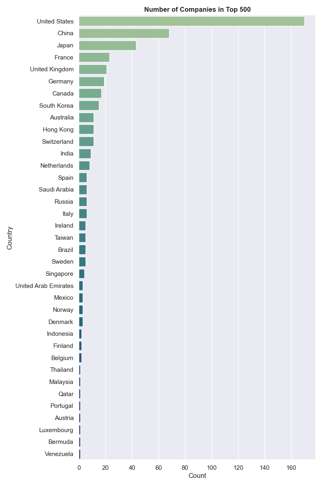

# Kaggle Task - The World's Biggest Public Companies 2021
This notebook represents my submission for the task on "[The World's Biggest Companies 2021](https://www.kaggle.com/berkayalan/the-worlds-biggest-companies-2021)" dataset. The description of the task is simply:
> Create an EDA and show breakdowns of companies

The [original source](https://www.forbes.com/lists/global2000/#242cc9bb5ac0) of the dataset is from Forbes, which ranks each of the companies according to the following equally-weighted metrics:
- Sales
- Profit
- Assets
- Market Value

## Exploratory Data Analysis
The results of my EDA can be found in the `notebook.ipynb` file. After a bit of preprocessing, several charts were produced to explore certain metrics within the data. An example of one such chart is shown below:

